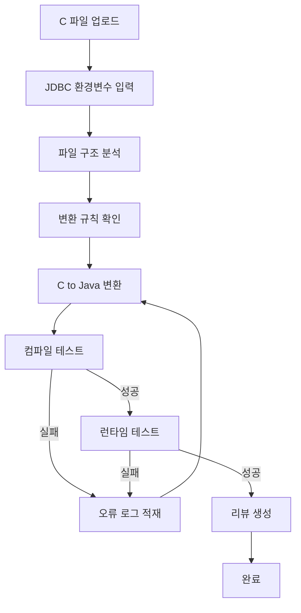

# C2JAVA 자동화 프로그램

C 언어 소스코드를 Java(Spring Boot 3.2.5)로 자동 변환하는 시스템

## 시스템 개요

폐쇄망 환경에서 운영되는 C to Java 변환 자동화 프로그램입니다.

### 주요 기능
- C 파일 업로드 및 구조 분석
- LLM 기반 코드 변환 (QWEN3 VL, GPT OSS)
- 자동 컴파일 및 오류 검증
- 런타임 테스트
- 변환 결과 리뷰 생성

## 기술 스택

| 구분 | 기술 |
|------|------|
| Backend | Spring Boot 3.2.5 (Java 21 LTS) |
| Frontend | React + TypeScript |
| CLI Tools | AIDER, Fabric |
| LLM | QWEN3 VL (235B), GPT OSS |
| Database | PostgreSQL |
| Batch | Apache Airflow |
| Monitoring | Grafana |
| Container | Docker, Docker Compose |
| MCP | Model Context Protocol |

## 프로젝트 구조

```
C2JAVA/
├── backend/                    # Spring Boot 백엔드
│   └── c2java-api/
├── frontend/                   # React 웹 프론트엔드
│   └── c2java-web/
├── cli/                        # CLI 통합 스크립트
│   ├── aider/
│   └── fabric/
├── config/                     # 환경 설정
│   ├── env/                    # 환경변수 파일
│   └── rules/                  # 변환 규칙
├── docker/                     # Docker 설정
│   ├── images/
│   └── compose/
├── airflow/                    # Airflow DAG 및 설정
│   ├── dags/
│   └── plugins/
├── monitoring/                 # Grafana 대시보드
│   └── dashboards/
├── docs/                       # 문서
└── scripts/                    # 유틸리티 스크립트
```

## 변환 프로세스



## 환경 설정

### 개발 환경 (외부망)
- Cursor IDE
- Claude Code CLI

### 운영 환경 (내부 폐쇄망)
- AIDER / Fabric CLI
- 사내 LLM (QWEN3 VL, GPT OSS)

## 시작하기

### 사전 요구사항
- Docker & Docker Compose
- Java 21 LTS
- Node.js 20 LTS
- Python 3.11+

### 설치 및 실행

```bash
# 1. 환경변수 설정
cp config/env/.env.example config/env/.env

# 2. Docker Compose 실행
docker-compose -f docker/compose/docker-compose.yml up -d

# 3. 백엔드 실행 (개발 모드)
cd backend/c2java-api
./gradlew bootRun

# 4. 프론트엔드 실행 (개발 모드)
cd frontend/c2java-web
npm install && npm run dev
```

## 라이선스

내부 전용

